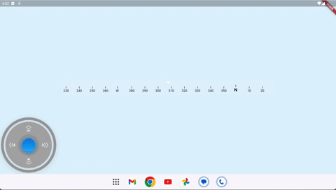

# Marine Compass



## How to use

```
CompassController controller = CompassController();
...
Compass(
        controller: controller,
        width: 800,
        itemWidth: 50,
    )
...
```

```
controller.scrollToHeading(90);
```

## Getting started

To use this package, add `marine_compass` as a dependency in your `pubspec.yaml` file:
